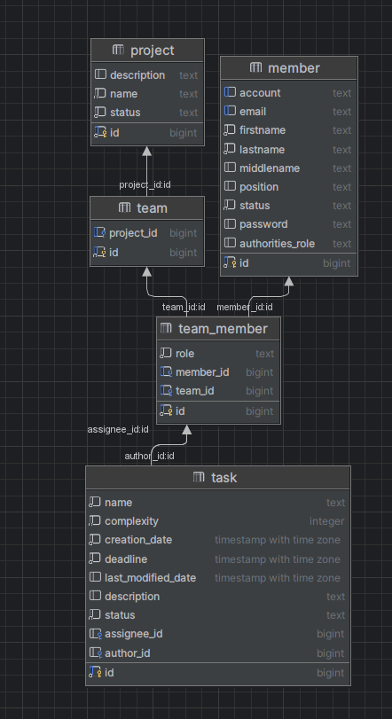

## Описание всех таблиц и аттрибутов

### Таблица member
В таблице member хранятся все сотрудники.\
Атрибуты:
- _id_ - уникальный идентфикатор сотрудника. Генерирутеся автоматически
- _lastname_ - Фамилия (обязательное поле)
- _firstname_ - Имя (обязательное поле)
- _middleName_ - Отчество (не обязательное)
- _position_ - Должность (не обязательное)
- _account_ - Учетная запись (не обязательное), но  уникальное значение среди активных 
сотрудников (у двух активных профилей не может быть одинаковой учетной записи, если оно не пустое).
- _email_ - Адрес электронной почты (не обязательное, уникальное значение)
- _status_ - Статус сотрудника - (обязательное поле) фиксированный набор значений (Активный, Удаленный).

### Таблица project
В таблице project хранится вся основная информация о проекте.\
Атрибуты:
- _id_ - Код проекта, некоторое уникальное имя проекта. 
Является обязательным и уникальным среди всех проектов.
- _name_ - Наименование, текстовое значение содержащее короткое наименование проекта. 
Обязательное поле.
- _description_ - Описание, текстовое значение содержащее более детальную информацию о проекте. 
Не обязательное поле.
- _status_ - Статус проекта, текстовое значение, обозначающее состояние проекта. 
Список статусов фиксированный (Черновик, В разработке, В тестировании, Завершен). Обязательное поле.

### Таблица task
В таблице task хранится вся основная информация о задачах.\
Атрибуты:
- _name_ - Наименование задачи, текстовое значение, отражающее краткую информацию о задачи (обязательное поле).
- _description_ - Описание задачи, текстовое значение, содержащее детальное описание задачи. (не обязательное поле)
- _assignee_id_ - Исполнитель задачи, сотрудник, которому необходимо исполнить задачу. (не обязательное поле).
- _complexity_ - Трудозатраты, оценка, сколько в часах необходимо на ее исполнение. (обязательное поле)
- _deadline_ - Крайний срок, дата, когда задача должна быть исполнена. Нельзя выбрать дату если дата меньше, 
чем  дата создания + трудозатраты. Обязательное поле.
- _status_ - Статус задачи, фиксированный список состояний задачи (Новая, В работе, Выполнена, Закрыта).
- _author_id_ - Автор задачи, заполняется автоматически, тем кто создавал задачу. 
Автором задачи может являться только участник проекта.
- _creation_date_ - Дата создания, дата когда задача была создана.
- _last_modified_date_ - Дата последнего изменения задачи, дата последнего редактирования задачи.

### Таблица team
В таблице team хранится id созданной команды и project_id - id проекта, над которым работает созданная команда\

### Таблица team_membership
Состав команды. В этой таблице первичный ключ составной - (team_id, member_id).\
Атрибуты:
- _team_id_ - идентификатор команды. Отношение к какой команде относится сотрудник.
- _member_id_ - идентификатор сотрудника относящегося к этой команде.
- _role_ - текстовой значение роли сотрудника в команде.
